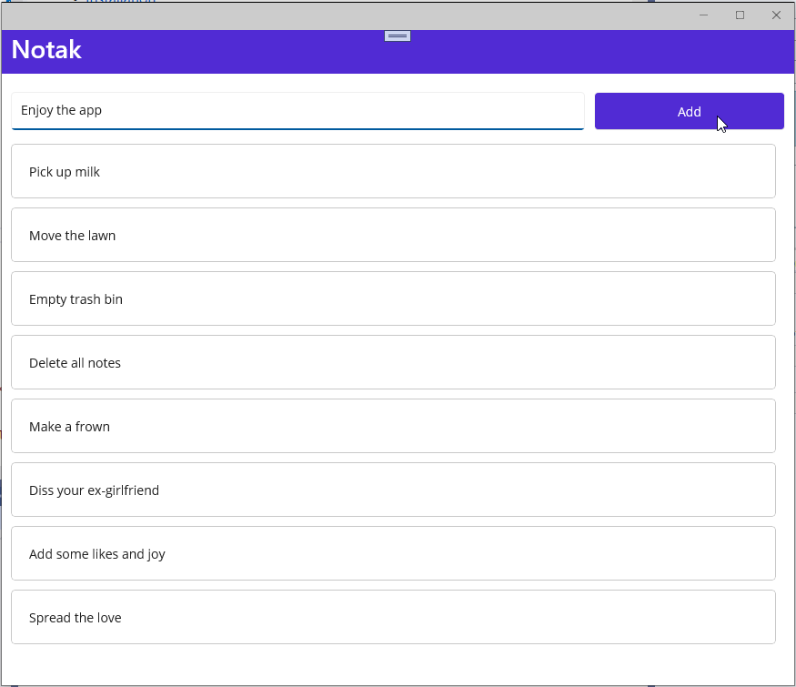

  
  <h1>Notak - Note taking app</h1>
  
  

    Application for simple notes written in .NET MAUI. 
  

  
<!-- Badges -->

  
  
  
  
  
  

   
<h4>
    <a href="https://github.com/Johnz86/Notak.App/issues/">Report Bug</a>
   · 
    <a href="https://github.com/Johnz86/Notak.App/issues/">Request Feature</a>
  </h4>

 

<!-- Table of Contents -->
# Table of Contents

- [Tech Stack](#tech-stack)
- [Roadmap](#roadmap)
- [License](#license)
  

<!-- About the Project -->
## About Notak

 
  

<!-- TechStack -->
### Tech Stack

- [.Net MAUI](https://docs.microsoft.com/en-us/dotnet/maui/)
- [CommunityToolkit](https://github.com/CommunityToolkit/dotnet)

## Roadmap

* [x] Adding simple tasks
* [ ] Improve the theme
* [ ] Persistance of notes
* [ ] Optional encryption of note
* [ ] Multiple note lists
* [ ] Sharing of note lists

<!-- License -->
## License

Distributed under the Unlicense. See LICENSE.txt for more information.
